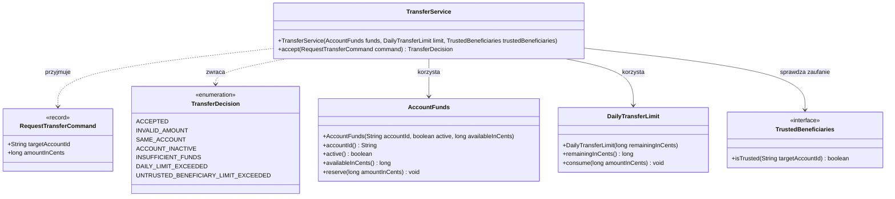

# Model subdomeny Przelewy

```mermaid
classDiagram
    direction TB
    class TransferService {
        +TransferService(AccountFunds funds, DailyTransferLimit limit, TrustedBeneficiaries trustedBeneficiaries)
        +accept(RequestTransferCommand command) TransferDecision
    }
    class RequestTransferCommand {
        <<record>>
        +String targetAccountId
        +long amountInCents
    }
    class TransferDecision {
        <<enumeration>>
        ACCEPTED
        INVALID_AMOUNT
        SAME_ACCOUNT
        ACCOUNT_INACTIVE
        INSUFFICIENT_FUNDS
        DAILY_LIMIT_EXCEEDED
        UNTRUSTED_BENEFICIARY_LIMIT_EXCEEDED
    }
    class AccountFunds {
        +AccountFunds(String accountId, boolean active, long availableInCents)
        +accountId() String
        +active() boolean
        +availableInCents() long
        +reserve(long amountInCents) void
    }
    class DailyTransferLimit {
        +DailyTransferLimit(long remainingInCents)
        +remainingInCents() long
        +consume(long amountInCents) void
    }
    class TrustedBeneficiaries {
        <<interface>>
        +isTrusted(String targetAccountId) boolean
    }
    TransferService ..> RequestTransferCommand : przyjmuje
    TransferService ..> TransferDecision : zwraca
    TransferService --> AccountFunds : korzysta
    TransferService --> DailyTransferLimit : korzysta
    TransferService --> TrustedBeneficiaries : sprawdza zaufanie
```
